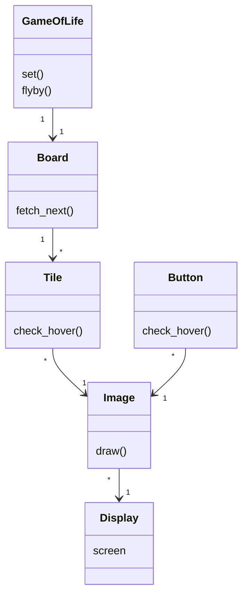
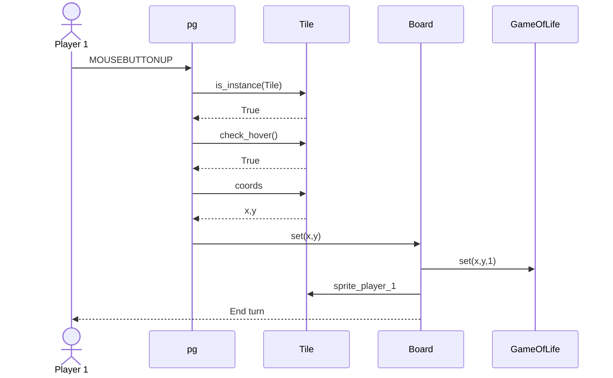

# Structure of the project

## Logic
The baseline logic of the project with all relevant classes and their methods is described with the below diagram. This description lacks the main gameplay loop, as that is not a class. Without reading through it understanding this graphic is going to be less useful.

The gist of the implementation is that the game logic resides in the uppermost GameOfLife class, the state of which can be modified by interacting with tiles through the display class, that are packed inside a board entity that contains the intersection between the graphical Tile instances and the logical GameOfLife instance. The board can utilise the fetch_next() method to update the boardstate from the one that the player has set to the next one. This change then affects the display. All graphical elements are also represented inside an Image class, such as tiles and buttons. Without this class communicating between the screen and the gameobjects would become chaotic.

## Main functionality 
### Change cell
The following graph goes through what happens when a cell is modified in the game screen from the perspective of the main loop as a class in itself, during a single frame.

This graph does simplify some things, such as the inheritance dynamics between Tile and it's parent Image, and ignores the complexity happening under pg. However otherwise it is quite a good depiction of what happens on an useful level of abstraction.
