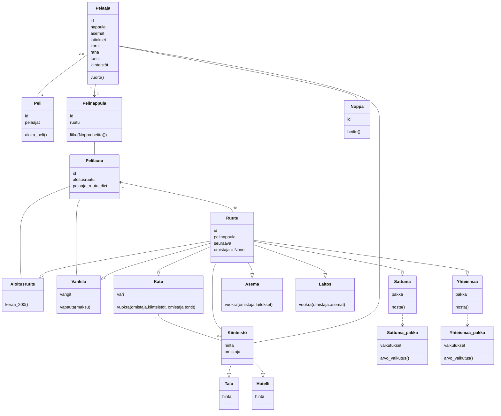

## structure of the project

```mermaid
 classDiagram
      Pelaaja "2..8" -- "1" Peli
      Pelilauta "1" <-- "40" Ruutu
      Pelilauta -- Aloitusruutu
      Pelilauta -- Vankila
      Pelinappula -- Pelilauta
      Pelaaja "1" --> "1" Pelinappula
      Pelaaja -- Noppa
      
      Ruutu --|> Aloitusruutu
      Ruutu --|> Vankila
      Ruutu --|> Sattuma
      Ruutu --|> Yhteismaa
      Ruutu --|> Asema
      Ruutu --|> Laitos
      Ruutu --|> Katu
      
      Kiinteistö --|> Talo
      Kiinteistö --|> Hotelli
      Kiinteistö -- Ruutu
      Kiinteistö -- Pelaaja
      Katu"1" -- "0..4"Kiinteistö
      
      Sattuma ..> Sattuma_pakka
      Yhteismaa ..> Yhteismaa_pakka
      class Noppa{
          id
          heitto()
      }
      class Pelaaja{
          id
          nappula
          asemat
          laitokset
          kortit
          raha
          tontit
          kiinteistöt
          vuoro()
      }
      class Pelilauta{
          id
          aloitusruutu
          pelaaja_ruutu_dict
      }
      class Pelinappula {
         id
         ruutu
         liiku(Noppa.heitto())
      }
      class Peli {
         id
         pelaajat
         aloita_peli()
      }
      class Kiinteistö {
          hinta
          omistaja
      }
      class Talo {
         hinta
      }
      class Hotelli {
         hinta
      }

      class Ruutu{
         id
         pelinappula
         seuraava
         omistaja = None
      }
      class Aloitusruutu {
         keraa_200()
      }
      class Vankila {
         vangit
         vapauta(maksu)
      }
      class Sattuma {
         pakka
         nosta()
      }
      class Sattuma_pakka {
         vaikutukset
         arvo_vaikutus()
      }
      class Yhteismaa_pakka {
         vaikutukset
         arvo_vaikutus()
      }
      class Yhteismaa {
         pakka
         nosta()
      }
      class Asema {
         vuokra(omistaja.laitokset)
      }
      class Laitos {
         vuokra(omistaja.asemat)
      }
      class Katu {
         väri
         vuokra(omistaja.kiinteistöt, omistaja.tontit)
      }

```
