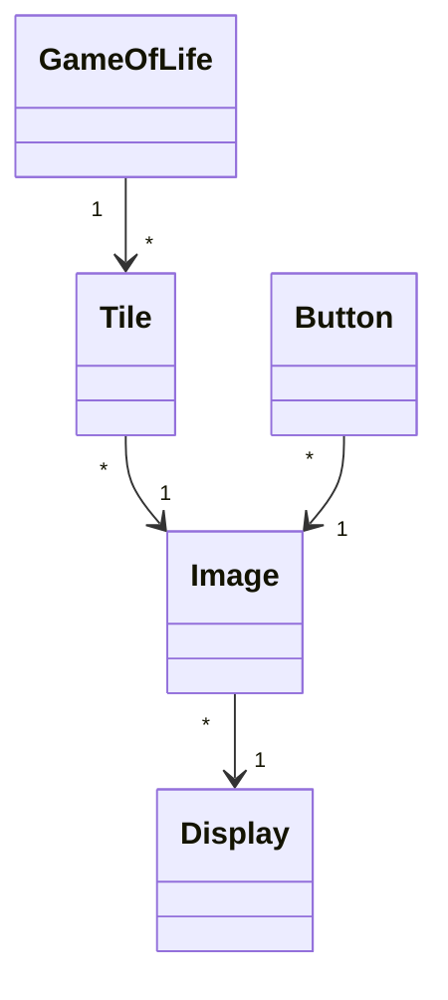

## structure of the project (excluding pygame functionality)

```mermaid
 classDiagram
 
      Tile "*" --> "1" Image
      Button "*" --> "1" Image
      
      Image "*" --> "1" Display
      
      GameOfLife "1" --> "*" Tile
      class Image {
      }
      
      class Display {
      }
      
      class Tile {
      }
      
      class GameOfLife {
      }
      
      class Button {
      }
```
