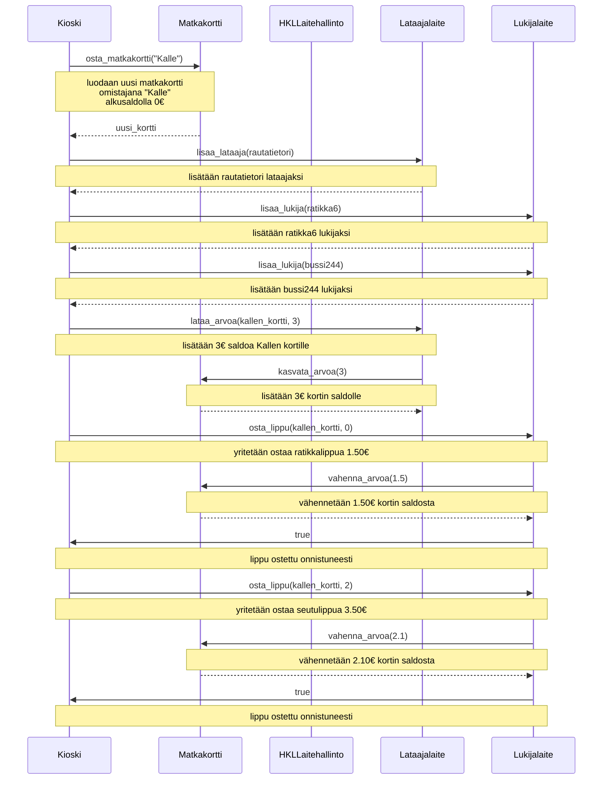

## Chatgpt test
Uteliaisuuttani laitoin chatGPT:n tekemään tehtävän. Sinäänsä ikävää koska luulisi että tällaisen tehtävän delegoiminen kielimallille olisi juuri noiden osaamisalueen keskiössä, mutta veikkaan että tarvitaan aikamoista kikkailua että saadaan se tuottamaan oikeanlainen kaavio. 

"""
[ code ]

Teemme sekvenssikaavion mermaid kielellä md tiedostoon. Kirjoita kaavio näiden ohjeiden mukaan:

Kuvaa sekvenssikaaviona koodin main-funktion suorituksen aikaansaama toiminnallisuus.

Muista, että sekvenssikaaviossa tulee tulla ilmi kaikki mainin suorituksen aikaansaamat olioiden luomiset ja metodien kutsut!
"""

