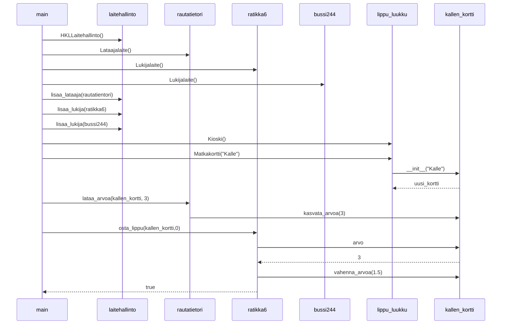

```mermaid
sequenceDiagram
     main ->> laitehallinto: HKLLaitehallinto()
     main ->> rautatietori: Lataajalaite()
     main ->> ratikka6: Lukijalaite()
     main ->> bussi244: Lukijalaite()
     main ->> laitehallinto: lisaa_lataaja(rautatientori)
     main ->> laitehallinto: lisaa_lukija(ratikka6)
     main ->> laitehallinto: lisaa_lukija(bussi244)
     main ->> lippu_luukku: Kioski()
     main ->> lippu_luukku: Matkakortti("Kalle")
     lippu_luukku ->> kallen_kortti : __init__("Kalle")
     kallen_kortti -->> lippu_luukku: uusi_kortti
     main ->> rautatietori: lataa_arvoa(kallen_kortti, 3)
     rautatietori ->> kallen_kortti: kasvata_arvoa(3)
     main ->> ratikka6: osta_lippu(kallen_kortti,0)
     ratikka6 ->> kallen_kortti: arvo
     kallen_kortti -->> ratikka6: 3
     ratikka6 ->> kallen_kortti: vahenna_arvoa(1.5)
     ratikka6 -->> main: true

```
