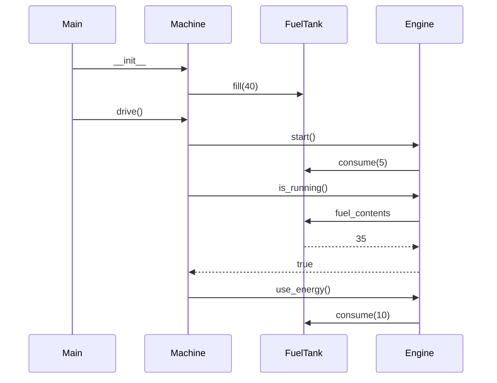

## Sekvenssi

```mermaid
sequenceDiagram
    Main ->> Machine: __init__
    Machine ->> FuelTank: fill(40)

    Main->>Machine: drive()
    Machine ->> Engine: start()  
    Engine ->> FuelTank: consume(5)
    Machine ->> Engine: is_running()
    Engine ->> FuelTank: fuel_contents
    FuelTank -->> Engine: 35
    Engine -->> Machine: true
    Machine ->> Engine: use_energy()
    Engine ->> FuelTank: consume(10)
```
