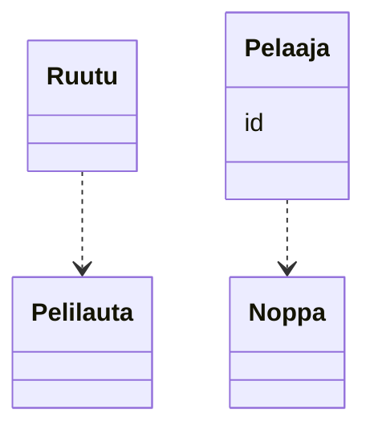

## Sovelluslogiikka

Sovelluksen loogisen tietomallin muodostavat luokat User ja Todo, jotka kuvaavat käyttäjiä ja käyttäjien tehtäviä:

```mermaid
 classDiagram
      Ruutu ..> Pelilauta
      Pelaaja ..> Noppa
      class Noppa{
      }
      class Pelaaja{
          id
      }
      class Pelilauta{
      }
      class Ruutu{
      }
```
